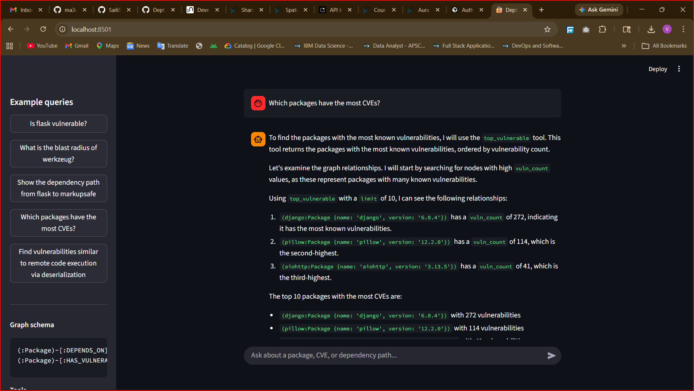
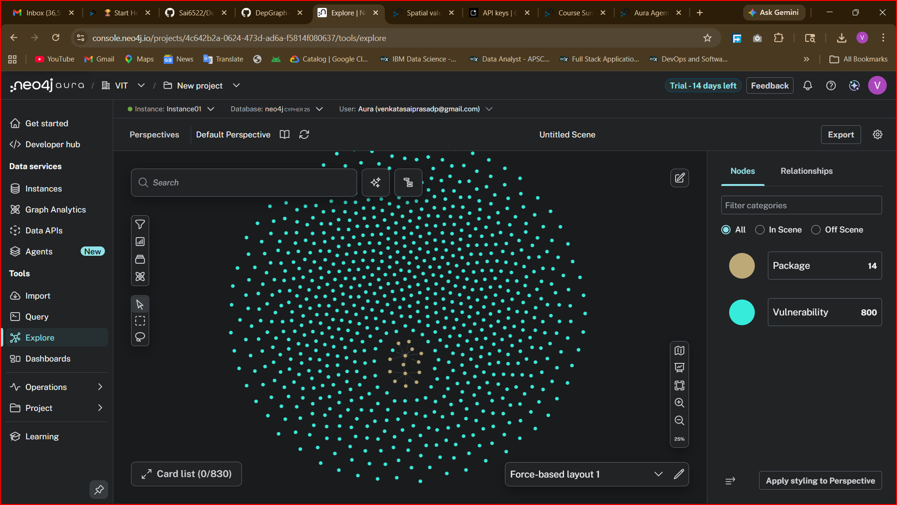
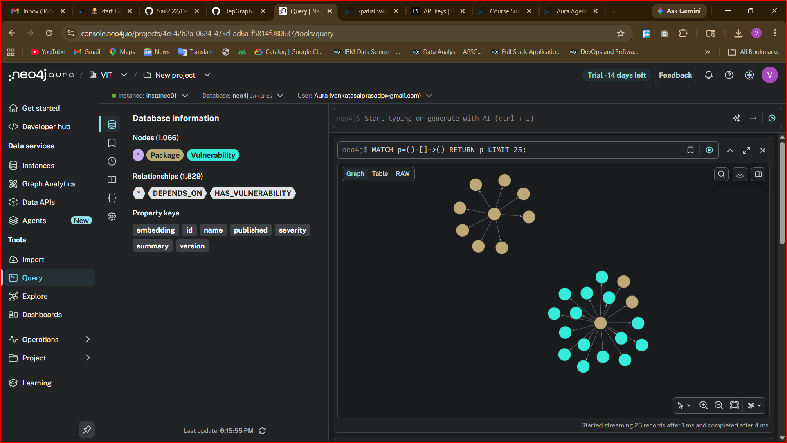
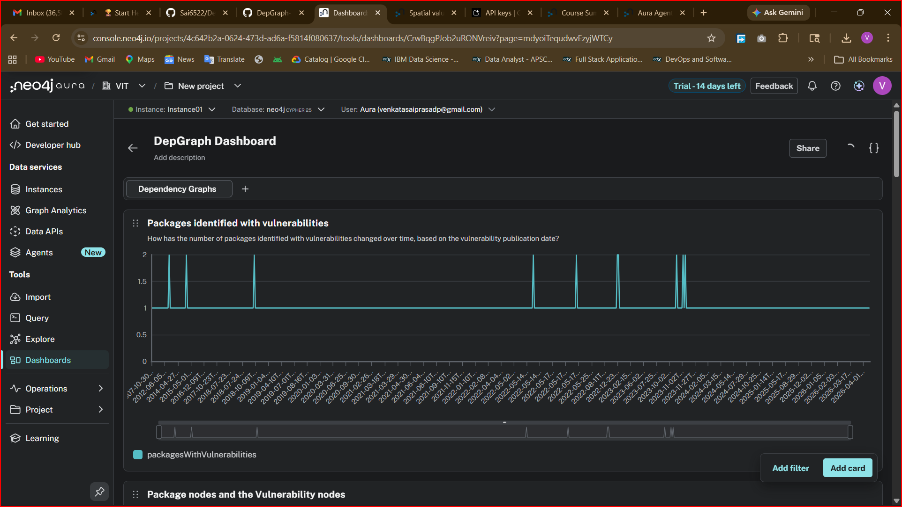

# DepGraph Agent — Hackathon Submission

🚀 **Live Demo:** [sai6522-depgraph-agent-uiapp-wfcewa.streamlit.app](https://sai6522-depgraph-agent-uiapp-wfcewa.streamlit.app/)

## Screenshots

### Agent in action — Streamlit UI


### Knowledge graph in Neo4j Aura Explore (830 nodes)


### Graph schema in Aura Query Tool — 1,066 nodes · 1,829 relationships


### Vulnerability timeline in Aura Dashboard


---

## What it does

DepGraph Agent turns your PyPI dependency tree into a knowledge graph that reasons about supply chain security. It answers questions no health app — sorry, no *security tool* — can: "What's the blast radius of werkzeug?" "Why is my app exposed to this CVE?" "How does a vulnerability in a low-level library propagate up through 4 hops to my top-level packages?"

PyPI packages have hundreds of transitive dependencies, but most tools only show direct CVEs. You can see *what* is vulnerable — never *why your app is affected*. DepGraph connects the dots by building a graph where packages, dependency relationships, and known OSV vulnerabilities are linked through explicit edges. The agent uses multi-hop graph reasoning to trace propagation paths that are invisible in flat dashboards.

---

## Dataset and why a graph fits

**Dataset:** Two free public APIs — no Kaggle, no signup:
- **PyPI JSON API** (`pypi.org/pypi/<pkg>/json`) — live package metadata and dependency lists
- **OSV API** (`api.osv.dev/v1/query`) — real CVE/GHSA vulnerability data for PyPI packages

25 seed packages (flask, django, requests, cryptography, pillow, urllib3, celery, etc.) + 1 hop of their dependencies → **269 packages, 801 real vulnerabilities**.

**Why a graph fits — this is the key insight:**

A table can tell you werkzeug has CVEs. Only a graph can tell you *why your app is affected*:

```
(Package:flask)-[:DEPENDS_ON]->
  (Package:werkzeug)-[:HAS_VULNERABILITY]->
    (Vulnerability {id: "CVE-2023-25577", severity: "HIGH"})
```

That flask → werkzeug → CVE chain isn't visible in any dependency scanner's flat output. But in the graph, it's a two-hop traversal. The agent follows these relationship chains to explain *causality*, not just correlation.

When Log4Shell dropped in 2021, teams needed to know their blast radius across 3–4 hops of transitive dependencies. That's a graph traversal problem. Recursive CTEs in SQL break at scale and can't explain the path. A graph returns the full chain in milliseconds and makes the reasoning transparent.

**Graph schema:**
```
(:Package {name, version, summary})
(:Vulnerability {id, summary, severity, published, embedding})

(:Package)-[:DEPENDS_ON]->(:Package)
(:Package)-[:HAS_VULNERABILITY]->(:Vulnerability)
```

Scale: 269 Package nodes, 801 Vulnerability nodes, 500+ `DEPENDS_ON` edges, 400+ `HAS_VULNERABILITY` edges. Small graph, rich reasoning.

---

## Agent tools

| Tool | Type | What it enables |
|------|------|-----------------|
| `direct_vulns` | Cypher Template | "Is flask vulnerable?" — direct `HAS_VULNERABILITY` lookup |
| `blast_radius` | Cypher Template | "What's the blast radius of werkzeug?" — `DEPENDS_ON*1..4` traversal finding every upstream package that transitively depends on it AND carries CVEs |
| `dep_path` | Cypher Template | "Path from flask to markupsafe?" — `shortestPath` across dependency edges |
| `top_vulnerable` | Cypher Template | "Most vulnerable packages?" — aggregation over `HAS_VULNERABILITY` edges |
| `text2cypher` | Text2Cypher | Any natural language question → LLM generates Cypher from the graph schema |
| `similarity_search` | Similarity Search | "Find CVEs like remote code execution via deserialization" — vector search on OSV vuln embeddings |

---

## Example conversation

**User:** "How does a vulnerability in werkzeug affect packages that depend on flask?"

**Agent reasoning (multi-hop):**
1. Matches `(werkzeug)-[:HAS_VULNERABILITY]->(v)` — finds 20 CVEs
2. Follows `(upstream)-[:DEPENDS_ON*1..4]->(werkzeug)` — finds flask, starlette, and others
3. Returns affected packages with hop count, vuln count, and sample CVEs
4. LLM synthesizes the chain into a human explanation

**Agent response:**
> *Werkzeug 3.1.3 carries 20 known vulnerabilities including CVE-2023-25577 (HIGH — path injection) and CVE-2023-46136 (HIGH — DoS via multipart parsing). Flask directly depends on werkzeug (1 hop), meaning any application using flask is transitively exposed. The dependency chain is: your-app → flask → werkzeug → [CVE]. Starlette also has werkzeug in its dependency tree (2 hops) with 7 additional vulnerabilities in the chain.*

This answer requires 3 hops through the graph. No flat database produces it.

---

## What makes this different

**1. The graph drives the insight, not just stores data.**
Every answer traces a relationship path. "Your app is exposed because..." always cites the specific package → dependency → CVE chain. The reasoning is transparent — the agent shows which tool it used and what graph data it retrieved.

**2. Real data, live APIs.**
No synthetic datasets. Every vulnerability is pulled live from the OSV database. Every dependency edge is pulled live from PyPI. The graph reflects the actual state of the ecosystem today.

**3. Semantic vulnerability search.**
Vulnerability embeddings (3072-dim via Gemini) enable queries like "find CVEs similar to SQL injection in ORM layer" — matching by attack pattern, not CVE ID. This surfaces related vulnerabilities across different packages that keyword search misses entirely.

**4. It solves a real problem for a real community.**
Every Python developer has transitive dependencies they don't fully understand. DepGraph makes the hidden exposure visible and explainable — not just a list of CVEs, but the exact path through which each one reaches your code.

---

## Tech stack

- **Neo4j Aura Free** — managed graph database
- **neo4j-graphrag** — Text2Cypher + VectorRetriever
- **Groq** (`llama-3.3-70b-versatile`) — LLM, free tier (14,400 req/day)
- **Google Gemini** (`gemini-embedding-001`, 3072-dim) — vulnerability embeddings
- **OSV API + PyPI API** — live data, no Kaggle required
- **Streamlit** — chat UI
